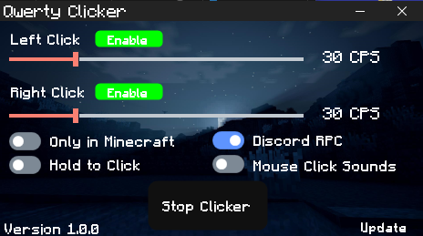

# QwertyClicker ✨
A homemade interface autoclicker using C# in Windows for Minecraft Bedrock & Java!

# How to Install 🕹
Download [QwertyClicker](https://github.com/xqwtxon/QwertyClicker/download/releases/latest/QwertyClicker.zip) and unzip the file and run `QwertyClicker.exe` and start read [wiki](/WIKI.md) for user guides!

# Prerequites 🛠
- A .NETFramework 4.0 or newer.
- Program `DLL` Files (include to run)
- Windows 10, 11 or later.

# Program Features 🏆
- Homemade Interface
- Easy to use
- Discord RPC
- Hold to click
- Only in Minecraft `javaw.exe & minecraft.windows.exe!`
- 1 click to stop button!
- Up to 100 cps!
- Customized Themes! `Dark & White Theme`
- Legit Sound Mouse Clicks! `works at 10-17cps only (Jitter)`

# Implemeted 🎯
Heres some implemented as now WIP:
- [x] User Interface (WIP not all) 
- [ ] Autoclicker
- [ ] Hold to Click
- [ ]  Only In Minecraft
- [ ] Legit Mouse Clicks Sounds
- [ ] Discord RPC

# Contribute 🤝
- Our teams need help from codes, you can help me by contributing in repo making [forks](https://github.com/xqwtxon/QwertyClicker/fork) and [issue](https://github.com/xqwtxon/QwertyClicker/issue/)
- You can see our [Contributing Information](/CONTRIBUTING.md)

# Support ❤
- You can support development by clicking star!
- You can support us by [donating](https://github.com/xqwtxon/xqwtxon/blob/main/DONATE.md) to us!
- Support us by making an [issue](https://github.com/xqwtxon/QwertyClicker/issue/) or pull request.

# License ©
- See our [Creative Common License](/LICENSE) for more info.

# Credits 💝
- [xqwtxon](https://github.com/xqwtxon)
- [MincoMK](https://github.com/MincoMK)
- [xVoiqMC](https://github.com/xVoiqMC)
- and for all contributors!