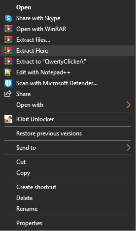

# Opening Program
- Once you downloaded the program in our [releases](https://github.com/xqwtxon/QwertyClicker/releases/) 
 
- You can now unzip the file named `QwertyClicker.zip` 
 
- After extracted files all files, click called `QwertyClicker` and run it. 
 
- And done! You can start now using autoclicker! 
